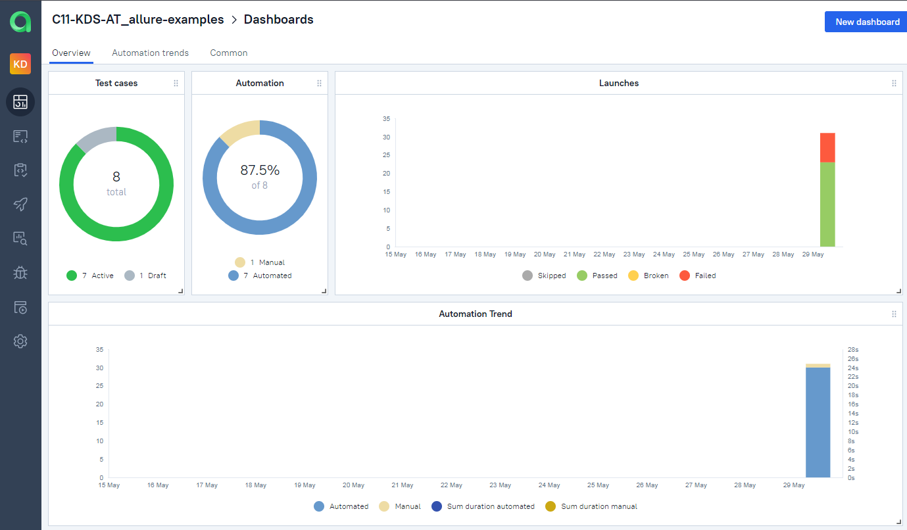
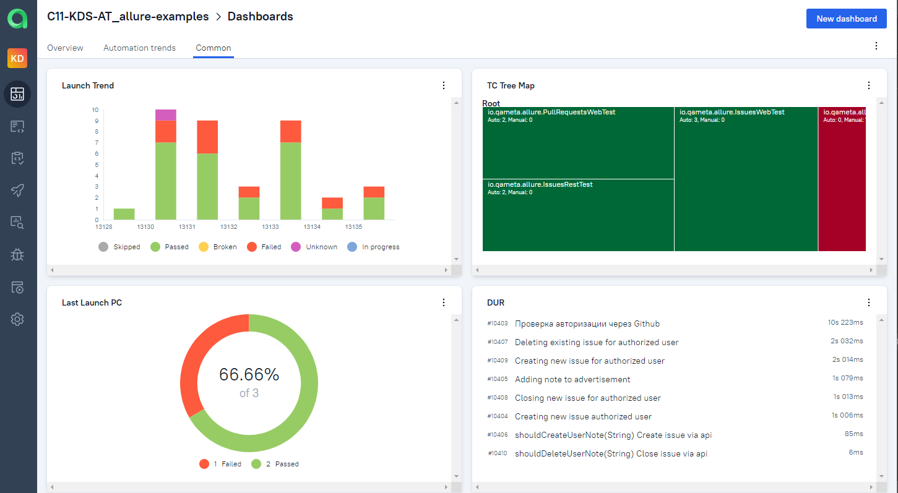
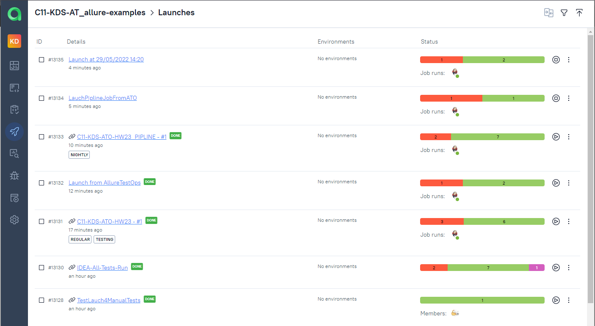
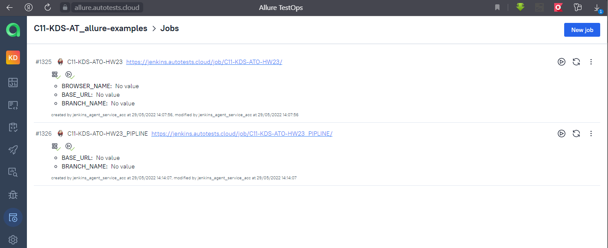

# Automation Tests (example configuration with using AllureTestOps )

## Technology Stack
|<a href="https://www.jetbrains.com/idea/"></a>  | <a href="https://qameta.io/"></a> |  |  |  |  |  |  |
|:------------------------------------------------------------------------------------------------------------------:|:--------------------------------------------------------------------------------------------------------:| :---------: |:---------------------------------------------------------------------------------------------------------------------:|:------------------------------------------------------------------------:|:------------------------------------------------------------------------------------:|:--------------------------------------------------------------------------:|:---------------------------------------------------------------------------:|
|                                                        IDEA                                                        |                                              AllureTestops                                               | Java |                                                          Git                                                          |                                  JUnite                                  |                                     Rest-Assured                                     |                                   Allure                                   |                                   Jenkins                                   |


##  Allure Test Ops:
##### https://allure.autotests.cloud/project/1358
>```С11-KDS-AT_allure-examples```
###  Dashboards:
  
###  Launches:

###  Jobs:



##  Jenkins:
##### https://jenkins.autotests.cloud/job/C11-KDS-ATO-HW23/
##### https://jenkins.autotests.cloud/job/C11-KDS-ATO-HW23_PIPLINE/
>pipeline example:
> ```
>  pipeline {
>    agent any
>    parameters {
>        string(name: 'BRANCH_NAME', defaultValue: 'master')
>        string(name: 'BASE_URL', defaultValue: 'https://testing.github.com')
>    }
>    stages {
>        stage('Checkout') {
>            steps {
>                git 'https://github.com/kdimkin1/KDS_AT_ALLURE_TEST_OPS.git'
>            }
>        }
>        stage('Test') {
>            steps {
>                withAllureUpload(name: '${JOB_NAME} - #${BUILD_NUMBER}', projectId: '1358', results: [[path: 'build/allure-results']], serverId: 'allure-server', tags: 'nightly') {
>                sh './gradlew clean test'
>                }                
>            }
>        }
>    }
> }


## Notes:
### For  Allure Test Ops:

* Dashboards -> Add widgets: Pay you attentions on Metrics:
> Summary Test Cases Duration -- evaluation of automation efficiency   
> 
> Retries count, Test Results count exclude retries, Summary retries duration -- assessment of the stability of the environment


### IDEA integration:
* Plugin:  Allure TestOps Support
1. Install plugin
2. Tools-> Allure -> Authorize
* For upload tests results:
>../builds/allure-results -> Allure: Uploads Results
> 
>       Project
>       Launch Name

### Jenkins:
* Plugin: Allure TestOps for Jenkins
>Dashboard->Configure Jenkins -> Plugin Manager -> Additional
-> Chose File
-> URL address:  (see: https://qameta.github.io/distributions/ use Latest Version )
Deploy

### Jira:
* Plugin: Allure TestOps for Jira 
>->Manage -> Configure:  Issue Tracker Key (see Allure Test Ops -> Issue Tracker)

* For migrate data from TMS Zephyr plugin to Allure Test Ops ask qameta.io support for migration scripts.

## Common links:
##### https://docs.qameta.io
##### https://qameta.github.io/distributions


